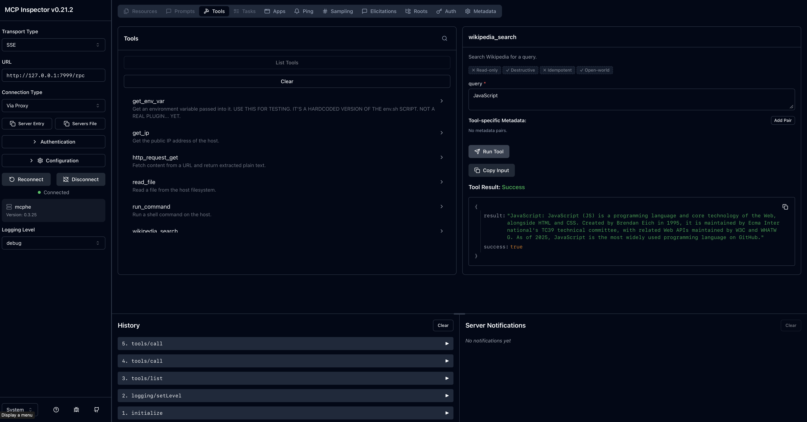

# MCP Host Engine (Go + JavaScript Plugins) Server


This repository contains a Go-based MCP server that runs tools as JavaScript plugins.  This allows versitility for the MCP server as many servers are product specific requiring one for GitHub, one for Google Docs, etc.  This allows you to plugin only what you need to create your own custom server  as a service  to be used by LLMs, AI agents, etc.  You can run the server on your local machine or on a remote server, and you can also run it as a Docker container.

## Features

- JSON-RPC 2.0 `/rpc` endpoint
- Pluggable tool support via `plugins/*.js`
- Configurable host, port, bearer auth, allowed domains, and enabled tools
- Built-in host APIs exposed to plugins (Namespaced modules: `host.fs`, `host.http` (with PATCH support), `host.exec`, `host.process`, `host.path`, `host.crypto`, `host.console`, `host.sleep`, `host.url`, `host.utils`)

## Run

1. Install dependencies and build:

```bash
go mod tidy
make build
```

2. Create tokens if using `token_secret` in config:

```bash
mcphe token create <username> <duration>
# ensure application uses token in Bearer field in header.
```

3. Start the server:

```bash
./mcphe config.yaml
```

4. Call the server via POST to `http://127.0.0.1:8001/rpc`.

## Configuration File Reference (`config.yaml`)

This section details the available settings for the MCP Host Engine. These values can be overridden in your `config.yaml` file to customize the server's behavior, network binding, and plugin security policies.

---

### Basic Server Settings

| Key | Type | Default | Description |
| :--- | :--- | :--- | :--- |
| `transport` | `string` | `"http"` | The transport to use for the MCP Host Engine.  Must be `"http"` or `"stdio"`. |
| `port` | `string` | `"8001"` | The network port the MCP Host Engine will listen on. |
| `host` | `string` | `"127.0.0.1"` | The network interface to bind the server to. Use `"0.0.0.0"` to listen on all interfaces. |
| `use_https` | `bool` | `false` | If set to `true`, the server will enforce HTTPS communication. |
| `cert_file` | `string` | *(none)* | Path to the SSL certificate file required when `use_https` is `true`. |
| `key_file` | `string` | *(none)* | Path to the private key file required when `use_https` is `true`. |
| `token_secret` | `string` | *(none)* | A shared secret used to sign and verify JWT tokens. All clients and servers must use the same secret. |
| `bearer_token` | `string` | *(none)* | Obsolete in future releases.  This is the static API key/token used for authenticating external client requests.  It will be replaced by tokens signed with the `token_secret`. |
| `pid_file` | `string` | *(none)* | The file path where the server's Process ID (PID) will be written upon startup. This is useful for process management. |

### Plugin and Tool Management

These settings control which plugins are available and what level of access they have.  Note that plugins are loaded at startup and are not dynamically reloadable.  If you change the plugins directory, you will need to restart the server.  If you change any of the other plugin settings, you will need to restart the server for the changes to take effect.  I

| Key | Type | Default | Description |
| :--- | :--- | :--- | :--- |
| `plugin_dir` | `string` | `"plugins"` | The local directory where the engine expects to find all JavaScript plugin files. |
| `plugins` | `map[string]map[string]interface{}` | *See Example* | Provides fine-grained, plugin-specific security and domain restrictions. The top-level key is the plugin name. |

### Security and Logging

| Key | Type | Default | Description |
| :--- | :--- | :--- | :--- |
| `verbosity_level` | `int` | `0` | The minimum logging level required for a message to be printed. Higher numbers mean more detailed logging (e.g., `3` might mean DEBUG level). |

---

### Advanced Plugin Restrictions (`plugins` Map)

The `plugins` map allows administrators to restrict the capabilities of individual plugins, enhancing security.

**Structure:**

```yaml
plugins:
  <plugin_name>:
    # Restrictions for this specific plugin
    enabled: true  # defaults true if defined at all. false if explicitly set to false. Remove it or false to disable
    allowed_domains: [...]
    allowed_write_file_paths: [...]
    allowed_read_file_paths: [...]
    allowed_commands: [...]
    allowed_env_vars: [...]
```

#### Detailed Restrictions

1. **`enabled`**:
   * **Type:** `boolean`
   * **Default:** `true` if the plugin is defined in the `plugins` map, `false` otherwise.
   * **Purpose:** Explicitly enables or disables a plugin. If `false`, the plugin will not be loaded or available to the MCP server.
   * **Example:**

     ```yaml
     plugins:
       my_plugin:
         enabled: false
     ```

2. **`allowed_domains`**:
    * **Type:** `list<string>`
    * **Purpose:** Restricts which domains a plugin (like `wikipedia_search` or `google_search`) is allowed to connect to via HTTP requests.
    * **Example:**

        ```yaml
        plugins:
          wikipedia_search:
            allowed_domains: ["en.wikipedia.org"]
        ```

3. **`allowed_write_file_paths`**:
    * **Type:** `list<string>`
    * **Purpose:** A list of absolute paths where the plugin is *permitted* to write files. If a path is not listed, writing to it will fail.
    * **Example:**

        ```yaml
        plugins:
          my_tool:
            allowed_write_file_paths: ["/tmp/output/"]
        ```

4. **`allowed_read_file_paths`**:
    * **Type:** `list<string>`
    * **Purpose:** A list of absolute paths where the plugin is *permitted* to read files.
    * **Example:**

        ```yaml
        plugins:
          data_processor:
            allowed_read_file_paths: ["/mnt/data/input.csv"]
        ```

5. **`allowed_commands`**:
    * **Type:** `list<string>`
    * **Purpose:** Limits the commands that a plugin can execute via the `runCommand` method. Each item in the list should be a full command string (e.g., `"ls -l /tmp"`).
    * **Example:**

        ```yaml
        plugins:
          os_utility:
            allowed_commands: ["ls -l", "pwd"]
        ```

6. **`allowed_env_vars`**:
    * **Type:** `list<string>`
    * **Purpose:** Specifies which environment variables the plugin is allowed to access via `getEnv`.
    * **Example:**

        ```yaml
        plugins:
          api_client:
            allowed_env_vars: ["API_KEY", "USER_ID"]
        ```

### Plugin Required Modules

Available built-in modules:

- fs
- http
- path
- crypto
- console
- sleep
- url
- utils

### Example Plugin Code

```javascript
// plugins/test_plugin.js
const { runCommand, http, fs, path, crypto, console, sleep, url, utils } = require('./lib/all.js');

module.exports = {
  name: "test_plugin",
  description: "A simple test plugin.",
  inputSchema: { type: "object", properties: {}, required: [] },
  call(params) {
    return "pong";
  }
};
```

---

### Example Usage

Here is an example demonstrating how to configure a dedicated analytics plugin (`analytics_reporter`) while keeping the built-in tools restricted.

```yaml
# config.yaml
port: "8080"
host: "127.0.0.1"
use_https: false
bearer_token: "super-secure-mcp-token"
plugins:
  # Security overrides for built-in tools
  wikipedia_search:
    allowed_domains: ["en.wikipedia.org"]
  
  google_search:
    allowed_domains: ["google.com"]
  
  # Custom plugin definition
  analytics_reporter:
    allowed_write_file_paths: ["/var/log/mcp_reports/"]
    allowed_read_file_paths: ["/app/data/metrics.csv"]
    allowed_commands: ["date"] # Only allow the 'date' command
    allowed_env_vars: ["REPORTING_ENV"]


## Plugin development

Create a JavaScript plugin in `plugins/` with `module.exports = { name, description, inputSchema, call }`.
The `call` function receives the JSON arguments object and may return a string, object, array, or primitive.

Example tool:

```js
module.exports = {
  name: "ping",
  description: "A simple ping/pong tool for testing.",
  inputSchema: { type: "object", properties: {}, required: [] },
  call(params) {
    return "pong";
  }
};
```

## Caveats

This was designed and tested with `gemma-4-31b` , `gemma-4-26b-a4b-it`, `gemma4:e2b` and many others including Qwen models.
I have had no issues with MCP HE working with OpenWebUI 0.9.X editions or later, LMStudio, MCP Inspector.

The n8n platform does not work at this time. It can login and see tools but fails to call them, for unknown reasons.

MCP Application support is currently in early stages and may not work with all applications. It functions well in MCP Inspector as pictured below.

## Development

To build and deploy a Docker container, see `Dockerfile`.  To run the server locally, see `tests/README.md` for instructions on building and running the server locally.

